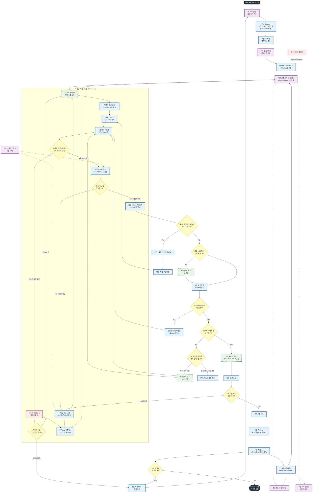

# Vibe Coding Workflow

```mermaid
graph TD
    %% 스타일 정의
    classDef terminal fill:#263238,stroke:#fff,stroke-width:2px,color:#fff;
    classDef process fill:#E3F2FD,stroke:#1565C0,stroke-width:2px;
    classDef decision fill:#FFF9C4,stroke:#FBC02D,stroke-width:2px;
    classDef ai_action fill:#E8F5E9,stroke:#2E7D32,stroke-width:2px,stroke-dasharray: 5 5;
    classDef data fill:#F3E5F5,stroke:#7B1FA2,stroke-width:2px;
    classDef warning fill:#FFEBEE,stroke:#C62828,stroke-width:2px;

    %% 1. 사전 기획 단계 (Pre-work)
    Start(["Start: 프로젝트 킥오프"]):::terminal
    Analyze["요구사항 및<br/>제약조건 분석"]:::data
    Spec["The Decree:<br/>기능/비기능 스펙 정의<br/>(SPEC.md 작성)"]:::process
    StackCheck["기술 스택 및<br/>아키텍처 결정"]:::process
    Repo_Context["기존 코드베이스<br/>컨텍스트 준비"]:::data
    Task_Split["Vertical Slice 단위로<br/>기능/태스크 분할"]:::process

    %% 요구사항 변경 (외부 이벤트)
    Change_Request["요구사항 변경 요청"]:::warning

    %% 2. 프롬프트 및 생성 단계
    Init_Prompt["태스크별 초기 프롬프트<br/>(Role/Task/Context 정의)"]:::data
    
    subgraph DevLoop ["AI 협업 개발 사이클 (Vibe Loop)"]
        direction TB
        AI_Coding["AI: 코드 생성 및<br/>파일 구조 잡기"]:::ai_action
        
        Human_Review["개발자 중간 검토<br/>(코드/구조 빠른 체크)"]:::process

        Syntax_Check["구문 검사 및<br/>린트(Lint) 체크"]:::process
        Run_Test["기능 테스트 실행<br/>(Unit/Manual)"]:::process
        
        IsError{"에러가 발생하는가?<br/>(Runtime/Logic)"}:::decision
        Debug_Prompt["에러 로그 첨부 &<br/>디버깅 요청"]:::warning
        Debug_Limit{"디버깅 시도<br/>타임박스 초과?"}:::decision
        
        Vibe_Review["결과물 Vibe 검토<br/>(속도/UX/코드 느낌)"]:::process
        IsVibeGood{"의도(Vibe)와<br/>일치하는가?"}:::decision

        Refine_Prompt["디테일 튜닝 요청<br/>(스타일/톤/UX 개선)"]:::process
        Checkpoint["중간 커밋/체크포인트<br/>(Undo 지점 확보)"]:::process
        Context_Refresh["컨텍스트 리프레시<br/>(요약 후 새 세션)"]:::process
    end

    %% 규제/보안/핵심 로직 게이트
    Critical_Area{"규제/보안/핵심 로직에<br/>영향이 있는가?"}:::decision
    Human_DeepReview["인간: 심층 코드/설계 리뷰"]:::process
    Human_ManualCode["인간: 직접 구현/수정"]:::process

    %% 3. 최적화 및 마무리 (Post-work)
    Refactor_Check{"코드 구조 개선/<br/>최적화 필요?"}:::decision
    AI_Refactor["AI: 리팩토링 및<br/>클린업"]:::ai_action
    
    Security_Check["보안 취약점 및<br/>예외처리 점검"]:::process

    Perf_Check{"성능/비용/접근성<br/>기준 만족?"}:::decision
    Perf_Tuning["성능/쿼리/레이아웃<br/>튜닝(AI+인간)"]:::process

    Test_Coverage{"테스트 커버리지<br/>충분한가?"}:::decision
    AutoTest_Strategy{"AI 테스트 보강이<br/>계속 실패하는가?"}:::decision
    AI_TestGen["AI: 테스트 코드<br/>생성/보강"]:::ai_action
    Human_Test["인간: 테스트 수동 보완"]:::process

    Doc_Gen["AI: 문서화 생성<br/>(README, API Docs)"]:::ai_action
    Final_Review["최종 인간 검토"]:::process
    Prod_Approve{"프로덕션 배포<br/>승인 여부?"}:::decision

    Deploy["프로덕션 배포"]:::process

    %% 4. 운영 & 학습 사이클
    Monitor["모니터링 및<br/>로그/지표/피드백 수집"]:::process
    Feedback_Analyze["피드백 분석<br/>(로그/지표/사용자 의견)"]:::process
    NeedMore{"추가 개발이<br/>필요한가?"}:::decision
    Product_Backlog["제품/기능 백로그<br/>업데이트"]:::process
    Prompt_Learn["프롬프트/패턴<br/>라이브러리 업데이트"]:::process

    %% 프롬프트/지식 자산
    Knowledge_Base["프로젝트 지식 베이스"]:::data
    Prompt_Templates["프롬프트 템플릿<br/>라이브러리"]:::data
    Code_Style_Guide["코드 스타일 가이드<br/>(팀 규칙)"]:::data

    End(["End: 더 이상<br/>큰 변경 없음"]):::terminal

    %% 연결 로직 - 사전 기획
    Start --> Analyze
    Analyze --> Spec
    Spec --> StackCheck
    StackCheck --> Repo_Context
    Repo_Context --> Task_Split
    Task_Split --> Init_Prompt
    Init_Prompt --> AI_Coding

    %% 요구사항 변경 → 태스크 재분할
    Change_Request -.->|Context 업데이트| Task_Split
    
    %% DevLoop 내부 연결
    AI_Coding --> Human_Review
    Human_Review --> Syntax_Check
    Syntax_Check --> Run_Test
    Run_Test --> IsError
    
    %% 에러 발생 시 처리 + 타임박스
    IsError -->|Yes: 기술적 오류| Debug_Prompt
    Debug_Prompt --> Debug_Limit
    Debug_Prompt --> Context_Refresh
    Debug_Limit -->|계속 시도| AI_Coding
    Debug_Limit -->|상위 재검토| Product_Backlog

    %% 에러 없음 -> Vibe 체크
    IsError -->|No: 동작 성공| Vibe_Review
    Vibe_Review --> IsVibeGood
    
    %% 코드 스타일 가이드 참조
    Code_Style_Guide -.-> Vibe_Review
    Code_Style_Guide -.-> Refine_Prompt

    %% Vibe 불일치 시 처리
    IsVibeGood -->|No: 느낌이 다름| Refine_Prompt
    Refine_Prompt --> AI_Coding
    Refine_Prompt --> Context_Refresh
    
    %% Vibe OK → 체크포인트 저장 후 규제/핵심 영역 체크
    IsVibeGood -->|Yes: 완성도 OK| Checkpoint
    Checkpoint --> Critical_Area

    Critical_Area -->|Yes| Human_DeepReview
    Human_DeepReview --> Human_ManualCode
    Human_ManualCode --> Syntax_Check

    Critical_Area -->|No| Refactor_Check

    %% 컨텍스트 리프레시 (루프가 너무 길어질 때 선택적으로 사용)
    Context_Refresh --> Init_Prompt

    %% 리팩터링/보안/성능/테스트
    Refactor_Check -->|Yes| AI_Refactor
    AI_Refactor --> Security_Check
    Refactor_Check -->|No| Security_Check

    Security_Check --> Perf_Check
    Perf_Check -->|No| Perf_Tuning
    Perf_Tuning --> Run_Test
    Perf_Check -->|Yes| Test_Coverage

    %% 테스트 커버리지 & 탈출 전략
    Test_Coverage -->|No| AutoTest_Strategy
    AutoTest_Strategy -->|AI로 계속 보강| AI_TestGen
    AI_TestGen --> Run_Test

    AutoTest_Strategy -->|반복 실패, 사람 개입| Human_Test
    Human_Test --> Run_Test

    Test_Coverage -->|Yes| Doc_Gen
    
    %% 문서화/최종 승인/배포
    Doc_Gen --> Final_Review
    Final_Review --> Prod_Approve

    Prod_Approve -->|승인| Deploy
    Prod_Approve -->|보류/반려| Refine_Prompt

    %% 운영 & 피드백 루프
    Deploy --> Monitor
    Monitor --> Feedback_Analyze
    Feedback_Analyze --> NeedMore
    NeedMore -->|Yes| Product_Backlog
    NeedMore -->|No| End
    Feedback_Analyze --> Prompt_Learn

    Product_Backlog --> Analyze
    Prompt_Learn --> Init_Prompt

    %% 프롬프트/지식 자산 연결 (보조 관계)
    Init_Prompt -.-> Knowledge_Base
    Init_Prompt -.-> Prompt_Templates
    Prompt_Learn -.-> Knowledge_Base
    Prompt_Learn -.-> Prompt_Templates
```
